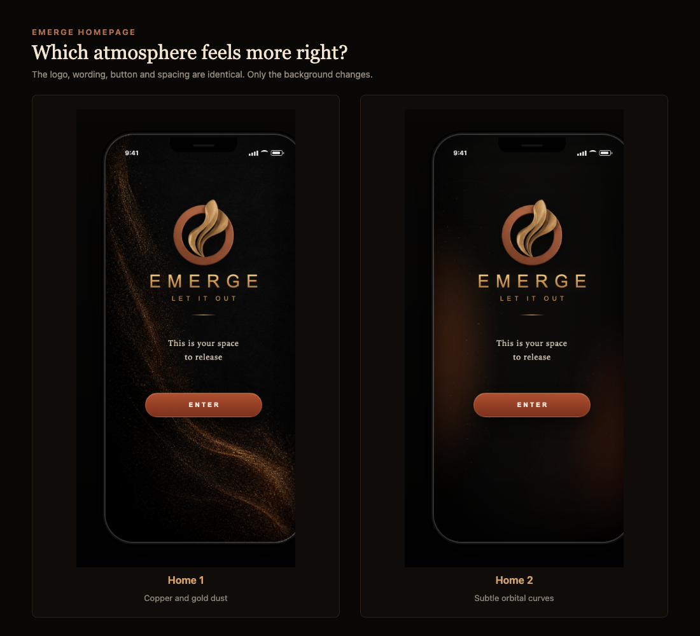

# Emerge — comparaison des homepages

Les deux versions utilisent exactement le même logo, les mêmes textes, le même bouton et les mêmes espacements. Seul le fond change.

## Home 1 — poussière cuivre et or

Version active. Le mouvement est organique, asymétrique et concentré sur les bords, avec un centre noir calme.

## Home 2 — courbes orbitales

Version précédente, conservée intégralement. Le fond utilise des lignes courbes très discrètes et des points cuivre répartis dans l'image.

## Questions pour recueillir des avis

1. Quelle version paraît la plus élégante et raffinée ?
2. Quelle version donne le plus envie d'appuyer sur Enter ?
3. Dans quelle version le logo et le texte ressortent-ils le mieux ?
4. Quelle atmosphère correspond le mieux à une expérience émotionnelle profonde : Home 1 ou Home 2 ?

## Changer la version active

Dans `index.html`, la balise `<body>` contient `data-home-version="home1"`. Remplacer seulement `home1` par `home2` permet de revenir immédiatement à l'ancienne version.
