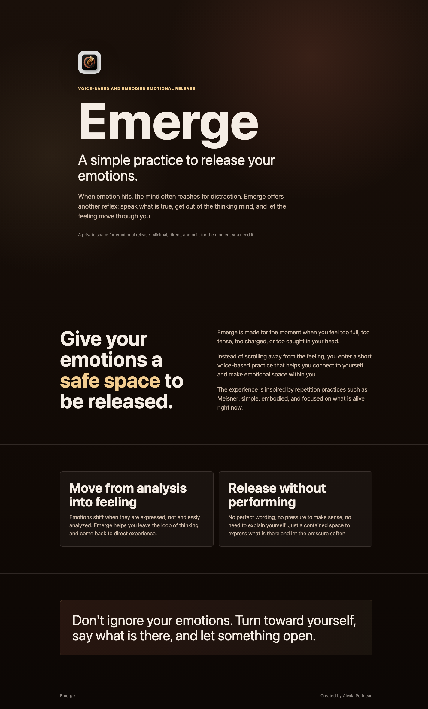

# Emerge · original website archive

This document preserves the first Emerge website before `alexiaperineau.com` is reassigned to Alexia Perineau's facilitator website.

- **Source:** `https://alexiaperineau.com/`
- **Captured:** 1 August 2026
- **Language:** English
- **Status:** exact copy of the published page; no editorial corrections have been made

## Visual reference

## Metadata

**Page title**

Emerge

**Description**

A voice-based and embodied emotional release practice.

## Hero

**Eyebrow**

Voice-based and embodied emotional release

**Name**

Emerge

**Tagline**

A simple practice to release your emotions.

**Lead paragraph**

When emotion hits, the mind often reaches for distraction. Emerge offers another reflex: speak what is true, get out of the thinking mind, and let the feeling move through you.

**Supporting line**

A private space for emotional release. Minimal, direct, and built for the moment you need it.

## Main statement

Give your emotions a safe space to be released.

Emerge is made for the moment when you feel too full, too tense, too charged, or too caught in your head.

Instead of scrolling away from the feeling, you enter a short voice-based practice that helps you connect to yourself and make emotional space within you.

The experience is inspired by repetition practices such as Meisner: simple, embodied, and focused on what is alive right now.

## Practice principles

### Move from analysis into feeling

Emotions shift when they are expressed, not endlessly analyzed. Emerge helps you leave the loop of thinking and come back to direct experience.

### Release without performing

No perfect wording, no pressure to make sense, no need to explain yourself. Just a contained space to express what is there and let the pressure soften.

## Closing statement

Don't ignore your emotions. Turn toward yourself, say what is there, and let something open.

## Footer

Emerge

Created by Alexia Perineau

## Visual system

- Near-black warm brown background.
- Warm ivory typography with a muted gold accent.
- Large sans-serif headings and generous vertical space.
- Thin, low-contrast section dividers.
- Two bordered principle panels displayed side by side on desktop.
- Minimal footer with the product name and creator credit.

## Backup files

- `original-index.html`: exact HTML downloaded from the live website.
- `logo.png`: logo used by the archived page.
- `emerge-original-site-fullpage.png`: full-page visual capture at desktop width.
- `Emerge-original-site-archive.docx`: editable document for Apple Pages or Microsoft Word.
